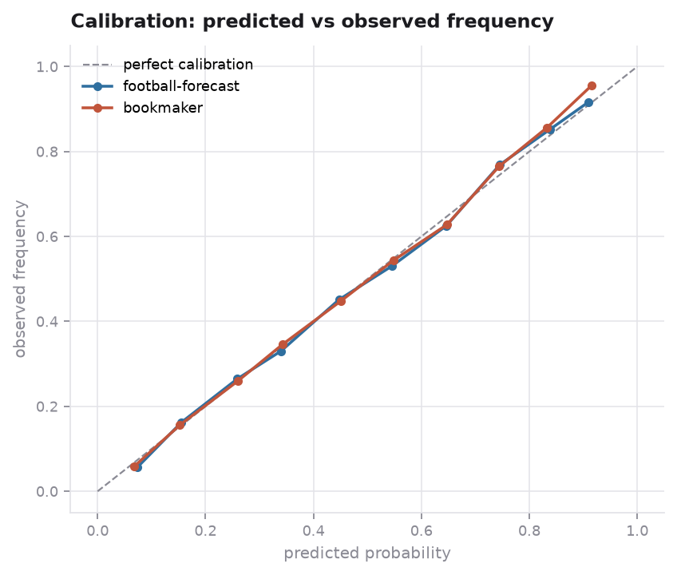
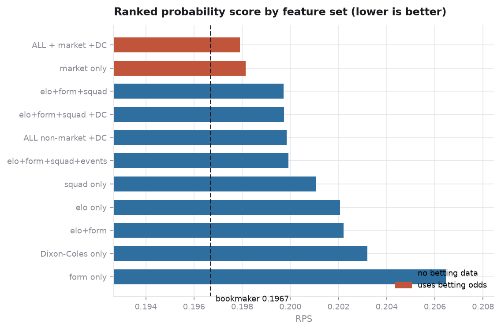
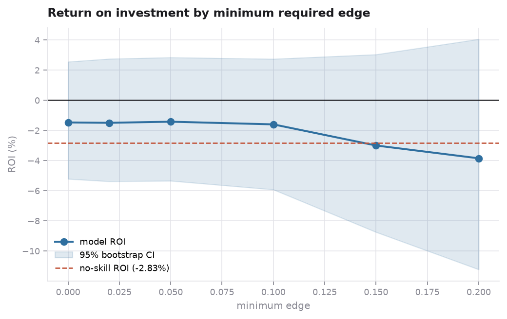

# pitchcast

Probabilistic football match forecasting, benchmarked against the betting market.

Predicts home/draw/away probabilities for 25,979 matches across 11 European
leagues (2008-2016), evaluated with strictly chronological walk-forward
validation and scored with proper scoring rules rather than accuracy.

**The headline result: using no betting data at all, the model reaches an RPS of
0.1997 against the bookmaker's 0.1967 — recovering 83% of the market's edge over
base rates from public match data alone. It does not beat the market, and this
README explains why that is the honest answer rather than a failure.**

---

## Results

All figures are out-of-sample, averaged over six held-out seasons (16,888
matches), each predicted by a model trained only on the seasons that preceded it.

| Forecast | RPS ↓ | Log loss ↓ | Accuracy ↑ | Calibration error ↓ |
|---|---|---|---|---|
| Always predict a home win | 0.4144 | 18.68 | 45.9% | 0.361 |
| Base rates (46/25/29) | 0.2274 | 1.0655 | 45.6% | 0.008 |
| Dixon-Coles alone | 0.2032 | 0.9960 | 51.5% | 0.008 |
| **pitchcast (no betting data)** | **0.1997** | **0.9844** | **52.2%** | **0.011** |
| pitchcast + market features | 0.1979 | 0.9791 | 52.6% | 0.010 |
| **Bookmaker (Bet365, devigged)** | **0.1967** | **0.9728** | **53.0%** | **0.004** |

Skill scores against the base-rate forecast: the market improves on it by 13.5%,
and the model by 11.2%. The model therefore captures **83% of the market's edge
without observing a single price.**



The model is nearly as well calibrated as the market across the whole
probability range, which is what makes the probabilities usable rather than
merely rank-ordered.

### What each feature block is worth



| Feature set | RPS | vs base rates | vs market |
|---|---|---|---|
| Rolling form only | 0.2065 | +8.4% | −5.0% |
| Elo only | 0.2021 | +10.2% | −2.7% |
| **FIFA squad ratings only** | **0.2011** | **+10.7%** | **−2.2%** |
| Elo + form + squad | 0.1997 | +11.2% | −1.6% |
| + match-event features | 0.1999 | +11.2% | −1.7% |
| + Dixon-Coles forecasts | 0.1997 | +11.2% | −1.6% |
| Market probabilities only | 0.1981 | +11.2% | −0.8% |

Three findings worth stating plainly:

- **Squad ratings are the single strongest block**, beating both Elo and rolling
  form on their own. Who is actually on the pitch matters more than how the club
  has been doing.
- **The match-event features are worth nothing** (0.1999 vs 0.1997), which
  matches what the data audit predicted before they were tried. See below.
- **Feeding the market's own probabilities through a model makes them worse**
  (0.1981 vs the market's 0.1967). The closing line is already an efficient
  forecast; a gradient booster can only add noise to it. This is the clearest
  argument against the common approach of dumping bookmaker odds into a
  classifier and reporting the resulting accuracy as a modelling result.

### Does it make money?

No, and the simulation is included because that is the interesting part.



Staking fractional Kelly on the best price across six bookmakers, on
out-of-sample forecasts only:

| Minimum edge | Bets | ROI | 95% bootstrap CI |
|---|---|---|---|
| 0% | 21,871 | −1.47% | [−5.21%, +2.56%] |
| 5% | 15,833 | −1.42% | [−5.34%, +2.85%] |
| 10% | 11,326 | −1.59% | [−5.92%, +2.75%] |
| 20% | 5,818 | −3.85% | [−11.22%, +4.06%] |

For context, the no-skill return is **−2.83%**: that is what a bettor loses to
the margin when shopping the best of six books (a single book charges −5.80%).
The model loses 1.4%, so it does convert roughly half the margin into edge — but
not enough to clear it, and the confidence intervals comfortably contain zero.
Reporting a positive point estimate from a single favourable threshold would
have been easy; the threshold sweep exists to make that impossible.

---

## Method

### Chronological validation, not random splits

Football data is a time series. A random `train_test_split` across eight seasons
trains on 2016 matches and tests on 2010 ones, which leaks the future in three
separate ways: the model knows how a season ended before predicting its opening
fixtures, it has already met the specific opponents in the test match, and any
imputation computed over the full frame carries test statistics into training.

Every result here uses expanding-window walk-forward validation: for each test
season, train on all prior seasons and predict that season cold. The first two
seasons are burn-in for Elo and rolling form and are never scored.

Every feature is lagged by construction, and this is enforced by tests rather
than assumed. `tests/test_leakage.py` rewrites the last twenty scorelines and
asserts no earlier Elo rating moves; rewrites a match's own result and asserts
its own pre-match form is unchanged; and checks against the real database that
no FIFA rating used by a match is dated on or after that match.

### Features

| Block | Description |
|---|---|
| `elo` | Margin-aware Elo with home advantage and between-season regression to the mean, one rating pool per league, hyperparameters tuned only on burn-in seasons |
| `form` | Rolling points, goals, clean sheets over 3/5/10 matches; season-to-date PPG; days of rest; fixture congestion; venue-specific form |
| `squad` | As-of FIFA ratings of the eleven who actually started: squad mean, top-4, per-line strength using formation coordinates, goalkeeper skill, squad age |
| `events` | Lagged shot, corner and possession volume parsed from the XML match feeds |
| `market` | Devigged bookmaker probabilities, consensus across six books, and inter-book disagreement |

### Models

- **Dixon-Coles bivariate Poisson**, the standard academic football model:
  per-team attack and defence parameters, a shared home-advantage term, the
  low-score dependence correction, and exponential time decay. Refit every 30
  days per league during each test season. It models the *scoreline*, so draws
  fall out of the diagonal instead of having to be learned against a 25% base
  rate, and over/under, both-teams-to-score and clean-sheet probabilities are
  sums over the same matrix.
- **LightGBM** over the engineered features, with native NaN handling (two
  thirds of matches have no event feed and 15% have an incomplete lineup, so
  mean-imputing would invent a league-average team where the data says
  "unknown") and untouched class priors, since the target is a proper scoring
  rule.

### Why not accuracy

Accuracy discards everything except the argmax, so a forecast of 34/33/33 and
one of 90/5/5 score identically when the favourite wins. The "always predict
home" baseline in the results table makes the point: it matches the base-rate
forecast on accuracy (45.9% vs 45.6%) while scoring a log loss of 18.7 against
1.07. RPS is the standard in football forecasting because it also respects the
ordering of the outcomes, penalising a predicted away win more than a predicted
draw when the home side wins.

---

## Data audit

Three problems in the source data that materially change the results, each found
by checking rather than assuming.

**40.5% of the "present" event feeds are empty stubs.** The `shoton` column is
non-null for 54.7% of matches, but 40.5% of those are `<shoton />`, which parses
successfully and yields a count of zero. Counting them as genuine zeros files
~5,800 ordinary matches (averaging 1.54 home goals) under "no shots taken".
Real usable coverage is 32.6%.

**The event feeds are weak even where they are populated.** Against a control —
the `goal` feed, which reconciles with the scoreline at r=0.96 — shot difference
explains goal difference at only r=0.13 and corner difference at r=0.07. Only
possession (r=0.24) carries real signal. This is why the events block is wired
in as ablatable rather than assumed useful, and why it contributes nothing.

**Bookmaker coverage is uneven.** Six books cover ~87% of matches; Pinnacle
covers 43%. Using all ten as equal features, as is common, silently weights the
sparse ones through imputation. Only the six dense books form the consensus.

---

## Relationship to the original analysis

This rebuilds a course project (CMSC320, Spring 2025) that reported "~65%
accuracy". `pitchcast audit` reproduces that pipeline and re-scores it. Three
things surfaced:

**A silent bug in the odds normalisation.** The original converted odds to
probabilities by overwriting each column in place:

```python
match_db[home] = ... (1/row[home]) / (1/row[home] + 1/row[draw] + 1/row[away]) ...
match_db[draw] = ... # row[home] is now a probability, not odds
```

By the second line the home column holds ~0.45 rather than ~2.2, and its
reciprocal re-enters the denominator. The resulting triples sum to **0.573 on
average** instead of 1.0, with the away probability collapsed to 0.021 against a
correct 0.281 — a 13× understatement across 20 of the 30 odds features feeding
every model in the notebook.

**The "70% accuracy" figure needs its baseline.** Reproduced at 68.97%. But it
was measured after dropping all draws, which removes 25% of matches and turns a
three-way problem into a two-way one where the majority class is **61.5%**, not
the 45.9% it was implicitly compared against. The real lift is 7.5 points.

**Random splitting cost less than expected.** Re-running the original design
chronologically moves accuracy by 0.67 points. Worth measuring rather than
asserting: the large leak was in the *evaluation framing*, not the split.

---

## Reproducing

```bash
uv sync
uv run pitchcast fetch          # 313 MB, checksum-verified
uv run pitchcast build          # parse feeds, tune Elo, build features
uv run pitchcast dixon-coles    # precompute and cache the DC forecasts
uv run pitchcast backtest       # walk-forward evaluation
uv run pitchcast ablate         # feature-block ablation
uv run pitchcast bet            # staking simulation
uv run pitchcast audit          # reproduce and re-score the original
uv run pitchcast report         # regenerate figures
uv run pytest                   # 38 tests, including the leakage suite
```

## Layout

```
src/pitchcast/
  data/       loader (tidy frames, checksum), events (XML feeds)
  features/   elo, form, squad, market (devigging), build (blocks)
  models/     dixon_coles, gbm, baselines
  evaluation/ metrics (RPS, log loss, ECE), betting, leakage, replication
  backtest.py walk-forward protocol
  report.py   figures
tests/        38 tests; test_leakage.py is the important one
```

## Data

[European Soccer Database](https://www.kaggle.com/datasets/hugomathien/soccer)
by Hugo Mathien: 25,979 matches, 11 leagues, 2008-2016, with lineups, FIFA
player and team attributes, ten bookmakers' odds, and XML match-event feeds.
Fetched from a [HuggingFace mirror](https://huggingface.co/datasets/julien-c/kaggle-hugomathien-soccer)
so no Kaggle credentials are needed.
